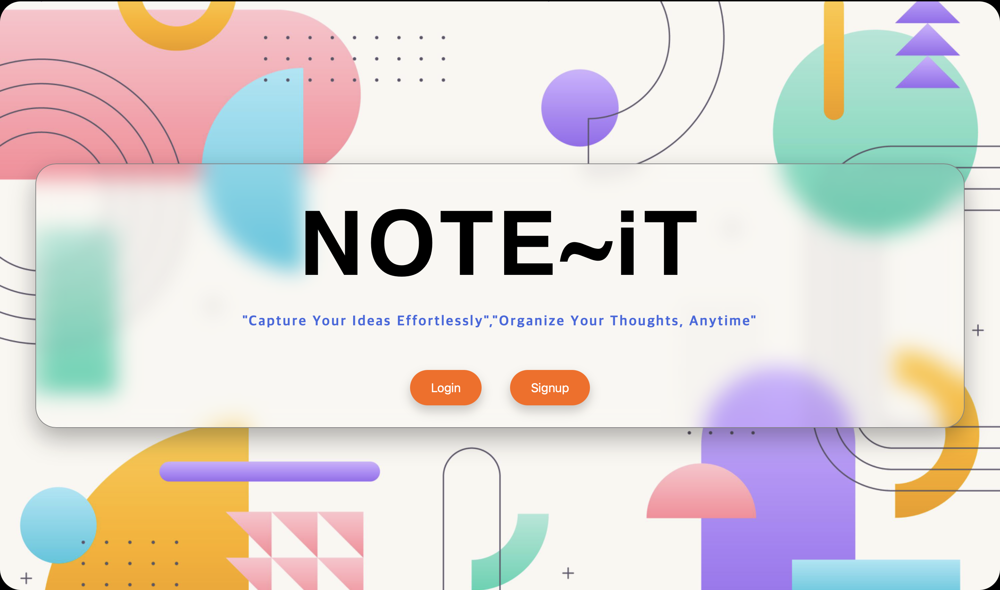

# Notify - Note Taking App (Frontend)
### Notes Page


This is the **frontend** part of the **Notify** note-taking application. The app allows users to create, update, delete, and manage their notes with a simple and user-friendly interface. The app features both **dark** and **light** mode toggles for enhanced user experience, and integrates a responsive design for various screen sizes.

## Live Demo

Check out the live version of the app: [Notify App](https://note-app-frontend-beta.vercel.app/)

## Features

- **User Authentication**: Login and signup functionality to manage user access.
- **Notes CRUD**: Create, read, update, and delete notes.
- **Dark/Light Mode Toggle**: Switch between dark and light mode for a personalized user experience.
- **Responsive Design**: Fully responsive design for mobile and desktop views.
- **Loading Spinners**: Visual feedback for loading states during note fetching, login, and signup processes.

## Tech Stack

- **Frontend**: ReactJS, JavaScript, Tailwind CSS, Material UI (for components like input fields)
- **Backend**: [Notify Backend](https://github.com/Amansingh0369/Note-App.git) (built with Node.js, Express, and MongoDB)
- **Authentication**: JWT (JSON Web Tokens) for secure login and signup.

## Installation

To run the project locally:

1. Clone the repository:
    ```bash
    git clone https://github.com/Amansingh0369/Note-App-Frontend.git
    ```
2. Navigate to the project directory:
    ```bash
    cd Note-App-Frontend
    ```
3. Install the required dependencies:
    ```bash
    npm install
    ```
4. Start the development server:
    ```bash
    npm start
    ```
   The app will run on `http://localhost:3000`.

## Project Structure

```bash
├── public
│   └── index.html           # Main HTML file
├── src
│   ├── components           # Reusable React components
│   ├── App.js               # Main App component
│   ├── Login.js             # Login component
│   ├── Signup.js            # Signup component
│   ├── Notes.js             # Notes component for managing notes
│   └── App.css              # Main CSS file
├── package.json             # Project metadata and dependencies
└── README.md                # Project documentation
